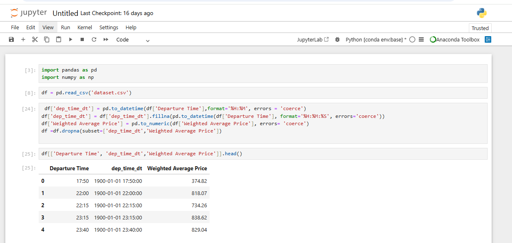
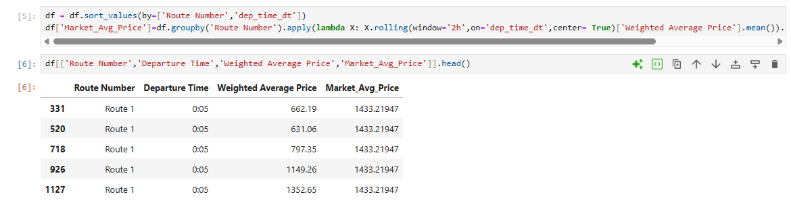
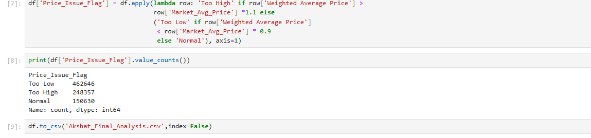

# 🚌 Flix: Growth Analytics & Pricing Intelligence
**Automating anomaly detection for 1 Million+ rows of mobility data.**

---

### 📌 Project Overview
This project was developed as part of a **Data & Growth Intern** assessment. The objective was to design a scalable pricing intelligence system to identify market anomalies and suggest growth opportunities.

### 🛠️ Key Technical Challenges

* **Big Data Handling:** Cleaned and processed a massive dataset of **1,000,000+ (10 Lakh) rows** using **Python (Pandas)**.

* **Standardization:** Resolved complex datetime formats (`%H:%M` & `%H:%M:%S`) and numeric inconsistencies to ensure 100% data integrity.

* **Market Benchmarking:** Defined "Similar Buses" based on `Route Number` and `Departure Time` to create accurate comparisons.

* **Automated Flagging:** Implemented a **2-hour rolling average** logic to detect if prices were **"Too High" (>1.1x)** or **"Too Low" (<0.9x)** compared to the market.

### 📸 Execution Proof (Visuals)

| 01. Data Cleaning & Standardization | 02. Rolling Market Average Logic | 03. Final Flags & Scalability (1M Rows) |
| :--- | :--- | :--- |
|  |  |  |
| **Action:** Fixed datetime formats and enforced numeric types for analysis. | **Action:** Grouped by Route Number with a 2h rolling window on `dep_time_dt`. | **Action:** Flagged 7 Lakh+ anomalies across 1M records. |

### 🚀 Automation MVP
As requested in the assignment brief, I proposed a **Python-based automation workflow** to replace manual Excel tracking. This ensures the system can handle daily data refreshes at scale without performance lags.

---
**Note:** This repository demonstrates the practical application of data wrangling and business logic for growth-focused roles.
